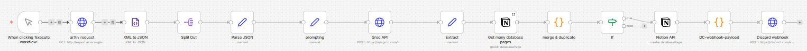

# n8n arXiv AI Tracker

Eine automatisierte n8n-Pipeline, die tagesaktuelle Machine-Learning-Paper von arXiv abruft, sie per LLM zusammenfasst und in eine Notion-Datenbank sowie einen Discord-Kanal pusht. 

## Features
- **Automatischer Abruf:** Zieht die neuesten Paper aus der arXiv-Kategorie `cs.LG` (Machine Learning).
- **KI-Zusammenfassung:** Nutzt Llama 3.1 8B (via Groq API) für eine strikte JSON-Extraktion (exakt 2 Sätze pro Paper + 1-3 Kern-Tags).
- **Dubletten-Schutz:** Gleicht neue Paper über ein JavaScript-Modul automatisch mit der bestehenden Notion-Datenbank ab, um doppelte Einträge zu verhindern.
- **Custom Discord Embeds:** Formatiert die Benachrichtigungen via Webhook in ein symmetrisches 3-Spalten-Layout.

## Architektur
Der Workflow besteht aus folgenden logischen Blöcken:
1. `HTTP Request`: Fragt die arXiv-API ab.
2. `XML to JSON & Parse`: Bereitet die Rohdaten für das Sprachmodell auf.
3. `Groq API`: Führt den System-Prompt aus und erzwingt das JSON-Format.
4. `Notion (Get All)` & `Code (Merge)`: Zieht bestehende URLs aus Notion und filtert bereits bekannte Paper heraus.
5. `Notion (Create)`: Speichert neue Paper als strukturierte Datenbank-Seite.
6. `Discord Webhook`: Baut den Payload und sendet das Alert-Embed.

## Voraussetzungen
- Eigene [n8n](https://n8n.io/)-Instanz (lokal oder Cloud)
- Groq API Key
- Notion Integration Token & Datenbank-ID
- Discord Webhook URL

## Installation & Setup

1. **Workflow importieren:**
   Lade die `Research-Tracker.json` herunter. Klicke in deinem n8n-Workspace oben rechts auf `Import from File` und wähle die Datei aus.

2. **Credentials hinterlegen:**
   - **Groq Node:** Trage deinen API-Key im Header unter `Authorization: Bearer DEIN_KEY` ein.
   - **Notion Nodes:** Wähle deine Notion-Credentials aus und ersetze die Platzhalter `YOUR_NOTION_DATABASE_ID` in beiden Notion-Nodes durch deine echte Datenbank-ID.
   - **Discord Node:** Ersetze die Platzhalter-URL im `Discord webhook` Node mit deinem eigenen Webhook-Link.

3. **Anpassen (Optional):**
   Standardmäßig sucht der Workflow nach `cat:cs.LG`. Um andere Kategorien zu tracken, passe einfach die URL im allerersten `arXiv request` Node an.
